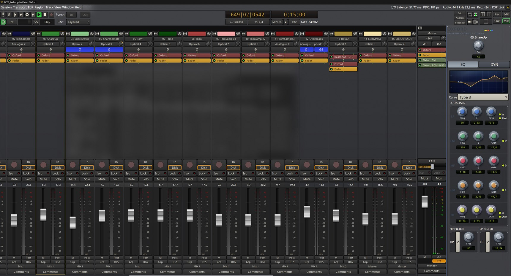

# Oxford — Reference Console · OXF-R3

Un fork d'[Ardour](https://ardour.org/) où la tranche de console est câblée dans chaque piste, et non ajoutée en plugin.

Tout ce qui colore le son est modelé sur du matériel Sony du milieu des années 90, dans l'ordre où le signal le traversait : le magnétophone numérique PCM-3348 à la prise, en tête de chaque piste ; la console OXF-R3 pour l'EQ, la dynamique et son propre convertisseur de sortie ; le convertisseur de mastering PCM-1630 tout en bout de master. Le DSP est écrit de zéro.

**[Page de présentation](https://aurelienjsureau.github.io/oxford-ardour/)** · **[Télécharger](https://github.com/aurelienjsureau/oxford-ardour/releases/latest)**

## Ce qu'il y a dedans

- **Panneau de console** ancré au bord droit du mixer, qui suit la piste sélectionnée. Dans les tranches, la ligne Oxford est le processeur lui-même : à sa place dans la chaîne, bypassable comme les autres.
- **EQ 5 bandes + filtres HP/LP** (6 à 36 dB/oct), réglables à la souris directement sur la courbe. La courbe tracée est la réponse réelle du filtre. Cinq lois de courbe, dont une topologie parallèle réciproque où les cuts sont le miroir exact des boosts.
- **Dynamique** : gate, expandeur, compresseur et limiteur en série, détection feed-forward en décibels comme sur l'unité d'origine, courbe de transfert et réduction par étage.
- **Limiteur de sortie** modelé sur l'Oxford Limiter (Knee, Enhance, Safe, Auto-Comp), placé tout en bout de master.
- **Profil PCM-1630** : un réseau entraîné sur un vrai convertisseur Sony PCM-1630 (capture, pas émulation écrite à la main), module à part sur le master.
- **Coloration bande** inspirée du PCM-3348 en tête de chaque piste.
- **Voies de retour** : les bus n'ont que LF/MF/HF plus compresseur et limiteur, comme sur la table d'origine.
- **Régie** : la section monitor d'Ardour intégrée au panneau (SiP/PFL/AFL, Dim, Mono, choix de sortie).
- **Lien par Alt** : Alt enfoncé applique un réglage à toutes les pistes sélectionnées.
- **Thèmes** Oxford, Warm, Amber et Night.

## Configuration requise

- Windows 64 bits (développé et testé sur Windows 11).
- Un processeur avec **AVX2 et FMA** (Intel Haswell 2013+, AMD 2015+) : en dessous, le modèle du PCM-1630 ne peut pas tourner.
- Une interface audio via PortAudio : ASIO, WASAPI ou WDM-KS.
- Environ 390 Mo sur le disque.

## Compilation

Même procédure qu'Ardour (voir [ardour.org/development.html](https://ardour.org/development.html)), avec `--program-name=Oxford` au configure. Les scripts de build Windows (MSYS2 + NSIS) sont dans `windows-build-kit/`, les workflows macOS et Linux dans `.github/workflows/`.

## Licence

Oxford dérive d'Ardour et suit sa licence GPL (voir `COPYING`). Ardour est développé par Paul Davis et les contributeurs du projet Ardour.

Sony, OXF-R3, PCM-3348 et PCM-1630 sont des marques de leurs propriétaires respectifs ; ce projet n'est ni affilié ni approuvé par Sony ou Sonnox.

---

*A fork of Ardour where the channel strip is wired into every track rather than added as a plugin, modelled on mid-90s Sony hardware (PCM-3348, OXF-R3 console, PCM-1630). See the [presentation page](https://aurelienjsureau.github.io/oxford-ardour/) (FR/EN).*
